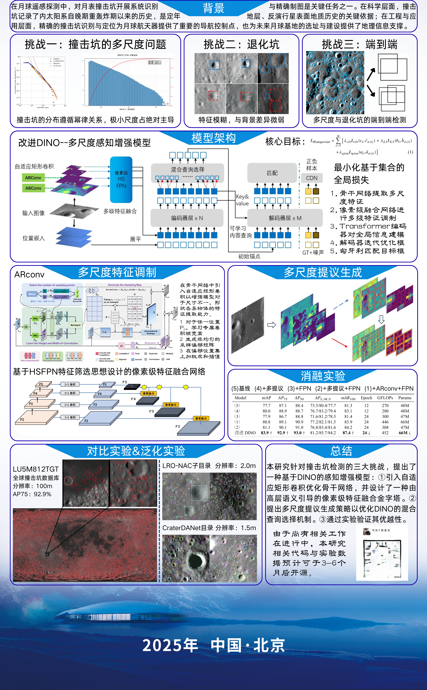
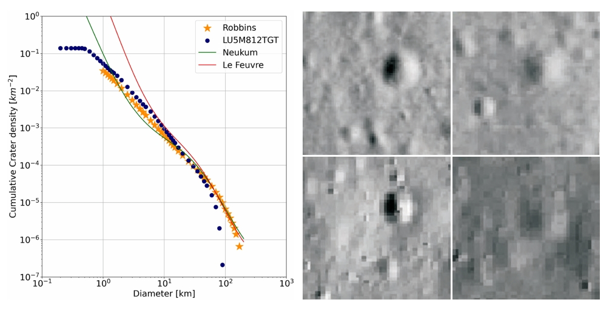
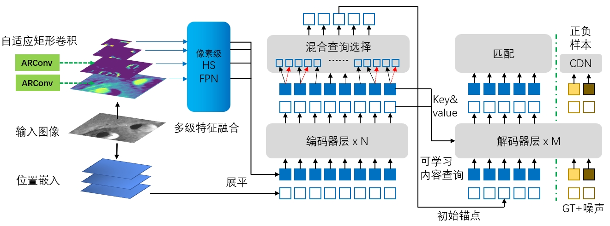
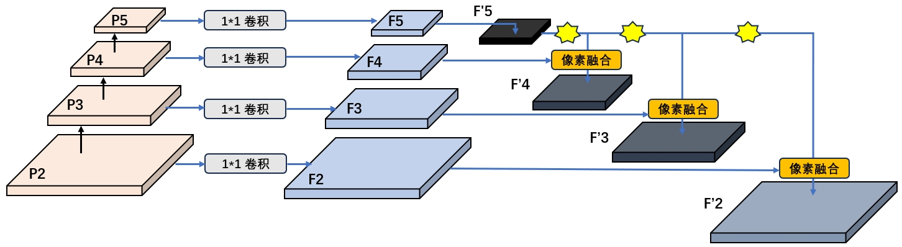
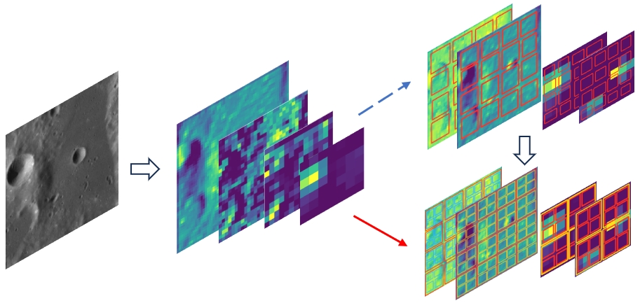
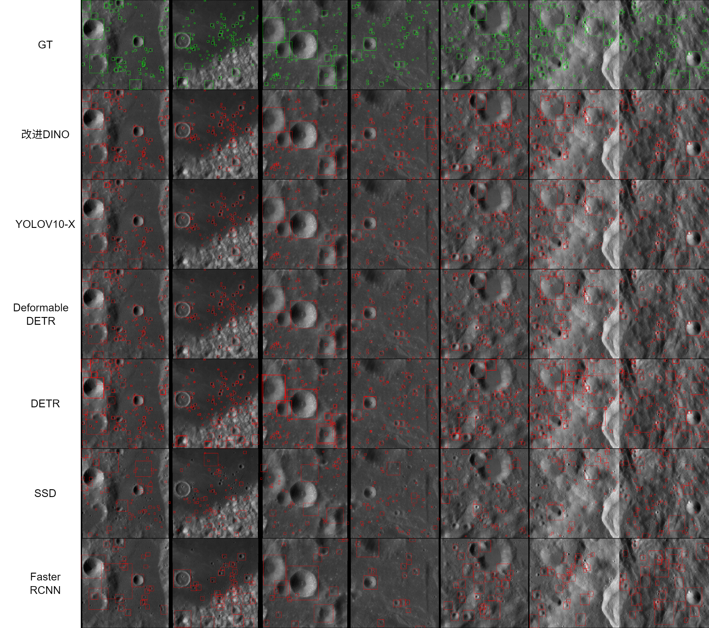

# Improved DINO for Crater Detection | 改进的DINO陨石坑检测模型


## Overview | 项目概述



This project presents an improved version of DINO (DETR with Improved DeNoising Anchor Boxes) specifically optimized for small crater detection tasks. The improvements focus on multi-scale feature extraction and enhanced detection capabilities for small objects.

本项目提出了一个改进版本的DINO目标检测模型，专门针对小型陨石坑检测任务进行优化。改进重点在于多尺度特征提取和增强小目标检测能力。

## Challenges in Small Object Detection | 小目标检测挑战



Small crater detection faces several challenges:
- Limited pixel information for small objects
- Scale variation across different crater sizes
- Complex background interference
- Dense distribution of craters

小型陨石坑检测面临以下挑战：
- 小目标像素信息有限
- 不同大小陨石坑的尺度变化
- 复杂背景干扰
- 陨石坑密集分布

## Improved Architecture | 改进架构

### Overall Architecture | 整体架构


The improved DINO architecture incorporates:
- HSFPN (Hierarchical Scale Feature Pyramid Network) for better multi-scale feature extraction
- Enhanced denoising training strategy
- Optimized anchor box generation

改进的DINO架构包含：
- HSFPN（层次化尺度特征金字塔网络）用于更好的多尺度特征提取
- 增强的去噪训练策略
- 优化的锚框生成机制

### HSFPN Module | HSFPN模块


HSFPN provides pixel-level feature fusion across multiple scales, enabling better detection of small craters.

HSFPN提供跨多个尺度的像素级特征融合，实现更好的小型陨石坑检测。

### Multi-scale Proposal Generation | 多尺度提议生成


The multi-scale proposal generation mechanism adapts to different crater sizes effectively.

多尺度提议生成机制能够有效适应不同大小的陨石坑。

## Experimental Results | 实验结果



Our improved DINO model demonstrates significant performance improvements over baseline methods in crater detection tasks.

我们改进的DINO模型在陨石坑检测任务中相比基线方法展现出显著的性能提升。

## Features | 主要特性

- **Multi-scale Detection | 多尺度检测**: Enhanced feature pyramid network for detecting craters of various sizes
- **Improved Small Object Detection | 改进的小目标检测**: Optimized for detecting small craters with limited pixels
- **End-to-End Training | 端到端训练**: Simplified training pipeline without complex post-processing
- **Flexible Architecture | 灵活架构**: Easy to adapt to different crater detection scenarios

## Installation | 安装

### Requirements | 环境要求
- Python 3.8+
- PyTorch 1.9+
- CUDA 11.0+ (for GPU training)

### Setup | 安装步骤

```bash
# Clone the repository | 克隆仓库
git clone https://github.com/zhytest123/Improved-DINO-for-crater.git
cd Improved-DINO-for-crater

# Install dependencies | 安装依赖
pip install -r requirements.txt

# Compile CUDA operators | 编译CUDA算子
cd models/dino/ops
python setup.py build install
cd ../../..
```

## Usage | 使用方法

### Training | 训练

```bash
# Single GPU training | 单GPU训练
python main.py --config config/DINO/DINO_4scale.py --output_dir outputs/

# Multi-GPU training | 多GPU训练
python -m torch.distributed.launch --nproc_per_node=4 main.py \
    --config config/DINO/DINO_4scale.py \
    --output_dir outputs/
```

### Evaluation | 评估

```bash
python main.py --config config/DINO/DINO_4scale.py \
    --eval --resume checkpoints/checkpoint.pth
```

### Inference | 推理

```bash
# Single image prediction | 单图预测
python experiments/single_image_prediction.py

# Batch inference | 批量推理
python experiments/evaluate_metrics.py
```

## Experiments | 实验脚本

The `experiments/` folder contains various scripts for different tasks:

`experiments/` 文件夹包含各种任务的脚本：

- `single_image_prediction.py` - Single image prediction and accuracy calculation | 单图预测和精度计算
- `evaluate_metrics.py` - Calculate test set metrics | 计算测试集指标
- `inference_visualization.py` - Visualize inference results | 推理结果可视化
- `comparison_visualization.py` - Compare with baseline methods | 与基线方法对比
- `data_filtering.py` - Data filtering utilities | 数据筛选工具

See `experiments/README.md` for detailed usage instructions.

详细使用说明请参考 `experiments/README.md`。

## Project Structure | 项目结构

```
Improved-DINO-for-crater/
├── config/              # Configuration files | 配置文件
├── models/              # Model architectures | 模型架构
├── datasets/            # Dataset processing | 数据集处理
├── util/                # Utility functions | 工具函数
├── tools/               # Helper tools | 辅助工具
├── experiments/         # Experiment scripts | 实验脚本
├── figs/                # Figures and images | 图片资源
├── main.py              # Main training script | 主训练脚本
├── engine.py            # Training engine | 训练引擎
└── README.md            # This file | 本文件
```

## Citation | 引用

If you find this work useful, please consider citing:

如果您觉得这项工作有用，请考虑引用：

```bibtex
@article{zhang2022dino,
  title={DINO: DETR with Improved DeNoising Anchor Boxes for End-to-End Object Detection},
  author={Zhang, Hao and Li, Feng and Liu, Shilong and Zhang, Lei and Su, Hang and Zhu, Jun and Ni, Lionel M and Shum, Heung-Yeung},
  journal={arXiv preprint arXiv:2203.03605},
  year={2022}
}
```

## Acknowledgments | 致谢

This project is based on the original [DINO](https://github.com/IDEACVR/DINO) implementation. We thank the authors for their excellent work.

本项目基于原始的 [DINO](https://github.com/IDEACVR/DINO) 实现。感谢作者们的出色工作。

## License | 许可证

This project is for research purposes only.

本项目仅用于研究目的。
